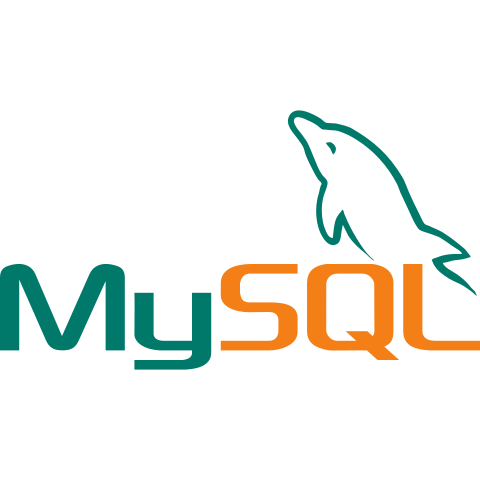
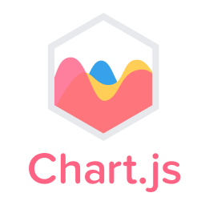

## 👋 &nbsp; Hey! Nice to see you

Welcome!

I'm Kamrul Islam, Backend Engineer and DevOps enthusiast 

[//]: # (from  <b>Bangladesh.</b>)

[//]: # (<a href="https://2kamrul.gitlab.io/" target="_blank">Portfolio</a>  )
 
[Portfolio](https://2kamrul.gitlab.io/)

## Things I code with

### DevOps
 &nbsp; &nbsp;
 &nbsp; &nbsp;
 &nbsp; &nbsp;
 &nbsp; &nbsp;
 &nbsp; &nbsp;
 &nbsp; &nbsp;
 &nbsp; &nbsp;
 &nbsp; &nbsp;
 &nbsp; &nbsp;
 &nbsp; &nbsp;
 &nbsp; &nbsp;
 &nbsp; &nbsp;
 &nbsp; &nbsp;
 &nbsp; &nbsp;

&nbsp;

### Backend
 &nbsp; &nbsp;
 &nbsp; &nbsp;
 &nbsp; &nbsp;
 &nbsp; &nbsp;
 &nbsp; &nbsp;
 &nbsp; &nbsp;
 &nbsp; &nbsp;
 &nbsp; &nbsp;
 &nbsp; &nbsp;
 &nbsp; &nbsp;
 &nbsp; &nbsp;
 &nbsp; &nbsp;

[//]: # (###### Frontend)

[//]: # ( &nbsp; &nbsp;  &nbsp; &nbsp;  &nbsp; &nbsp;  &nbsp; &nbsp;  &nbsp; &nbsp;  &nbsp; &nbsp;  &nbsp; &nbsp;  &nbsp; &nbsp;  &nbsp; &nbsp; )

[//]: # (###### OTHERS )

[//]: # ( &nbsp; &nbsp; )

 

[//]: # ([![Top Languages]&#40;https://github-readme-stats.vercel.app/api/top-langs/?username=2kamrul&layout=compact&theme=react&#41;]&#40;https://github.com/2kamrul/github-readme-stats&#41;)

[//]: # ([![Activity Graph]&#40;https://github-readme-activity-graph.cyclic.app/graph?username=2kamrul&theme=react&custom_title=Contribution%20Graph&#41;]&#40;https://git.io/praveenscience&#41;)

###### Where to find me

    
    
    
      
    

 
   
   
